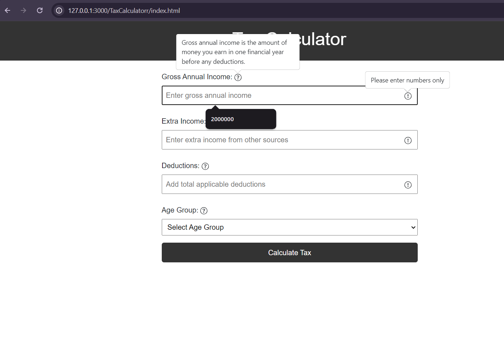
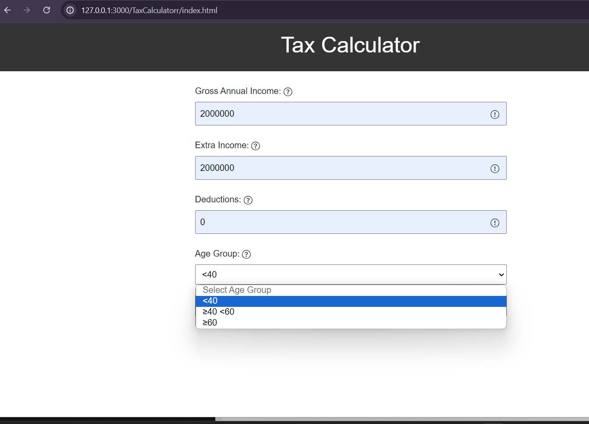
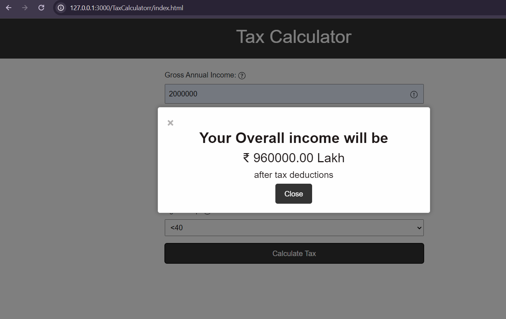

# Tax Calculator 

Website that allows for tax calculation based on a users input.

Visit Here:- https://661e264bc649ad00a8d03fdb--candid-sprite-46ddfe.netlify.app/

## Preview
 1.
  

2.
 

3.
  

### For Example:- 

 * Gross Annual Income - 2000000
 * Extra Income - 2000000 
 * Deductions - 0 
 * Age any you want if:-

        30% for people with age < 40,

        40% for people with age ≥ 40 but < 60

        10% for people with age ≥ 60
   
 Final Tax after Deductions is 960000.00 lakh
 
 
 

